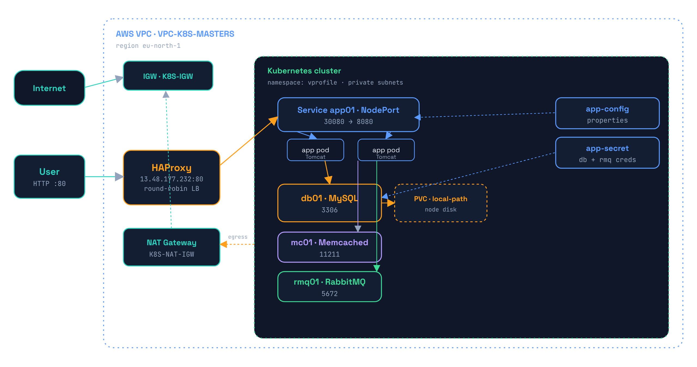
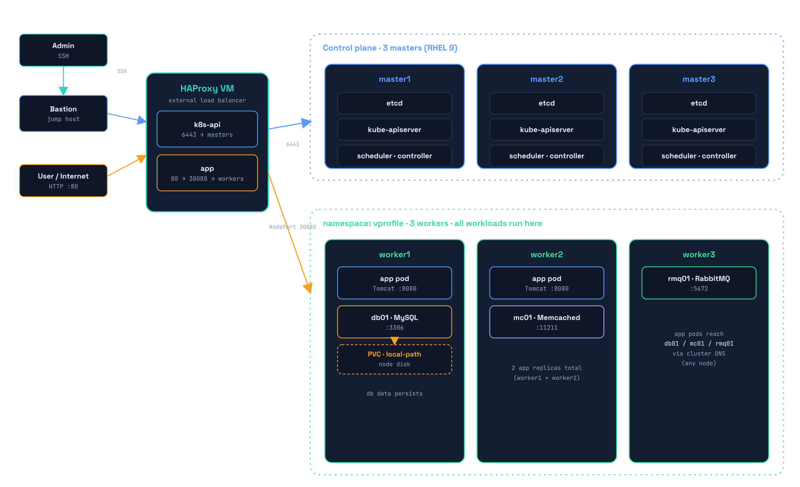
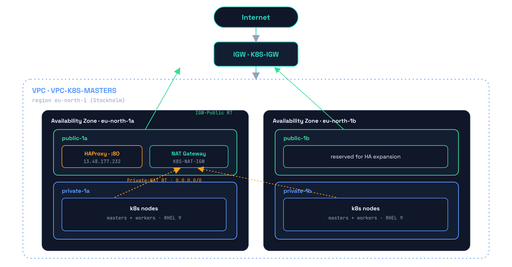
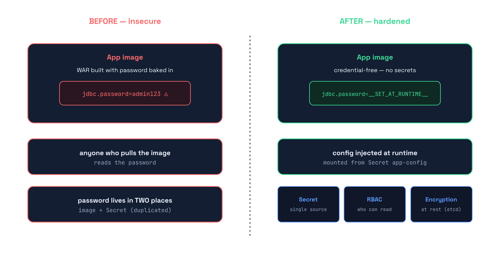

<h1 align="center">VProfile on Kubernetes</h1>

<p align="center">
  Deploying a multi-tier Java application as four secure microservices on a
  self-managed, highly-available Kubernetes cluster — running inside an AWS VPC,
  fronted by HAProxy.
</p>

<p align="center">
  
  
  
  
  
  
  
  
  
</p>

<p align="center"></p>

---

## Table of Contents

- [Overview](#overview)
- [Architecture](#architecture)
- [Repository Structure](#repository-structure)
- [Prerequisites](#prerequisites)
- [Quick Start](#quick-start)
- [Security](#security)
- [Update Strategies](#update-strategies)
- [Troubleshooting](#troubleshooting)
- [Acknowledgment](#acknowledgment)
- [Author](#author)

---

## Overview

**VProfile** is a classic multi-tier Java (Spring MVC) web application — a small social
network whose stack mirrors real enterprise systems. In its original form each tier ran
on its own VM. This project re-platforms it as **four independent microservices** on
Kubernetes: self-healing, scalable, and reproducible.

| Tier | Service | Image | Port |
|------|---------|-------|------|
| Application | `app01` | Tomcat 9 · Java WAR | 8080 |
| Database | `db01` | MySQL 8.0 (seeded `accounts`) | 3306 |
| Cache | `mc01` | Memcached | 11211 |
| Broker | `rmq01` | RabbitMQ | 5672 |

The original Nginx web tier is **dropped** — the existing **HAProxy** plays that role at the
cluster edge. All images are built from source, hardened, and pushed to `alnaqib/*`.

---

## Architecture

The whole platform runs inside an **AWS VPC** (`eu-north-1`) spread across two Availability
Zones. Public subnets host HAProxy and the NAT Gateway; private subnets host the Kubernetes
nodes. Traffic flows:

```
User → HAProxy (13.48.177.232:80) → NodePort app01 (:30080) → app pods → db01 · mc01 · rmq01
```

### Full topology

<p align="center"></p>

Administration comes in through a **Bastion** (SSH) to reach the HAProxy VM. HAProxy runs **two backends**:

- **`k8s-api` (`:6443`)** → load-balanced across the **3 masters** (control plane: etcd, kube-apiserver, scheduler).
- **`app` (`:80`)** → `NodePort :30080` load-balanced across the **3 workers**, which run every workload.

The **masters stay control-plane only**; all pods (`app` ×2, `db01`, `mc01`, `rmq01`) are scheduled on the **workers**. App pods reach `db01 / mc01 / rmq01` through cluster DNS regardless of which node they land on.

### Cloud network (AWS VPC)

<p align="center"></p>

- **2 Availability Zones** (`eu-north-1a` / `1b`) for a real HA spread.
- **4 subnets** — public (HAProxy, NAT) and private (k8s nodes).
- **Private nodes reach the internet via NAT → IGW**; the internet reaches the app only
  through HAProxy.

---

## Repository Structure

```
Vprofile-K8s/
├── build-and-push.sh          # build → Trivy scan → push to alnaqib/*
├── deploy.sh                  # install storage class + apply manifests in order
├── images/                    # one hardened Dockerfile per service
│   ├── app/                   # multi-stage Tomcat · credential-free
│   ├── db/                    # MySQL 8.0, seeded 'accounts'
│   ├── memcached/
│   └── rabbitmq/
├── k8s/                       # manifests, numbered in apply order
│   ├── 00-namespace.yaml
│   ├── 01-secret.yaml         # db + rmq credentials
│   ├── 02-db.yaml             # PVC + Deployment + Service (db01)
│   ├── 03-memcached.yaml
│   ├── 04-rabbitmq.yaml
│   └── 05-app.yaml            # app-config Secret + Deployment + NodePort (app01)
├── haproxy/vprofile.cfg       # frontend/backend for the HAProxy VM
└── src/                       # VProfile source (app + db images build from here)
```

---

## Prerequisites

- A Kubernetes cluster — this project targets **6 nodes (3 masters + 3 workers) on RHEL 9**,
  fronted by an HAProxy VM.
- A workstation with **Docker** (or Podman) and **Trivy** for building & scanning images.
- `kubectl` configured against the cluster.

---

## Quick Start

### 1. Build, scan & push the images

```bash
# clones src/ if missing, builds 4 images, scans with Trivy, pushes to Docker Hub
./build-and-push.sh
```

### 2. Deploy to the cluster

```bash
# installs local-path-provisioner, then applies manifests in order
./deploy.sh

# watch it come up
kubectl -n vprofile get pods -w
```

Expected result:

```
NAME                READY   STATUS    RESTARTS
vpro-app-xxxx       1/1     Running   0
vpro-app-xxxx       1/1     Running   0
vpro-db-xxxx        1/1     Running   0
vpro-mc-xxxx        1/1     Running   0
vpro-rmq-xxxx       1/1     Running   0
```

### 3. Expose via HAProxy & access

Add the `haproxy/vprofile.cfg` block on the HAProxy VM (fix the worker `INTERNAL-IP`s from
`kubectl get nodes -o wide`), then:

```bash
sudo haproxy -c -f /etc/haproxy/haproxy.cfg && sudo systemctl reload haproxy
```

Open the app:

| Method | URL |
|--------|-----|
| Via HAProxy (main) | `http://13.48.177.232/` |
| Direct NodePort | `http://<node-ip>:30080/` |
| Quick test | `kubectl -n vprofile port-forward svc/app01 8080:8080` |

Default login: **`admin_vp` / `admin_vp`**.

> Replace all demo passwords before any real use.

---

## Security

<p align="center"></p>

Security is applied in **layers**, each closing a different gap:

1. **Credential-free images** — the app WAR is built with **no password**; the real
   `application.properties` is mounted at runtime from a Secret. The image is generic and
   safe to store in a registry.
2. **Single-source Secret** — one place holds the password, so the layers below actually matter.
3. **RBAC** — restricts *who* can read the Secrets (base64 is encoding, not encryption).
4. **Encryption at rest** — protects the Secret inside `etcd` and its backups.
5. **For GitOps** — use **Sealed Secrets** or **SOPS** so nothing sensitive lands in Git.

Images are also hardened with multi-stage builds, non-root users, pinned base versions, and
a **Trivy** scan (HIGH/CRITICAL) before every push.

---

## Update Strategies

| Service | Strategy | Why |
|---------|----------|-----|
| **Database** (`db01`) | `Recreate` | The volume is `ReadWriteOnce` — only one pod may hold it. A rolling update would start a second pod on the same PV and corrupt it. Recreate stops the old pod first. |
| **Application** (`app01`) | `RollingUpdate` | The app tier is stateless. Two replicas are updated gradually with **zero downtime**; the readiness probe gates each new pod before it serves traffic. |

---

## Troubleshooting

Real issues hit (and fixed) while building this:

| Symptom | Root cause | Fix |
|---------|-----------|-----|
| HAProxy returns **503** | Health check `GET /` returns a **302** redirect to `/login`, so HAProxy marks every backend **DOWN** | Health-check `GET /login` (returns **200**), or accept `2xx,3xx` |
| App can't reach MySQL | MySQL 8 defaults users to `caching_sha2_password` → JDBC fails over plain TCP (`Public Key Retrieval is not allowed`) | Start MySQL with `--default-authentication-plugin=mysql_native_password` |
| Password leaks with the image | Credentials were **baked into the WAR** at build time | Credential-free image + `application.properties` mounted from a Secret |
| No traffic through HAProxy | Backend pointed at wrong worker IPs | Use real `INTERNAL-IP`s from `kubectl get nodes -o wide` |
| `PVC` stuck in `Pending` | No default StorageClass on a `kubeadm` cluster | Install `local-path-provisioner` and mark it default |

---

## Acknowledgment

Sincere thanks to **Eng. Abdelrahman** for the guidance, the clear explanations, and the
hands-on mentorship that made this project possible — especially the patience in teaching the
**"why"** behind every step, not just the **"how."**

---

## Author

**Yousef Salem** — DevOps Engineer · **ALnaqib**
Cairo, Egypt

- GitHub: [@yousefsalemW](https://github.com/yousefsalemW)
- Docker Hub: `alnaqib`

<p align="center"><sub>VProfile on Kubernetes · DevOps · 2026</sub></p>
