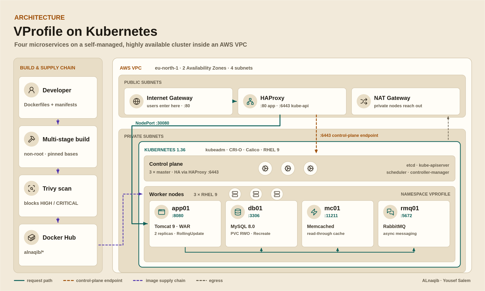
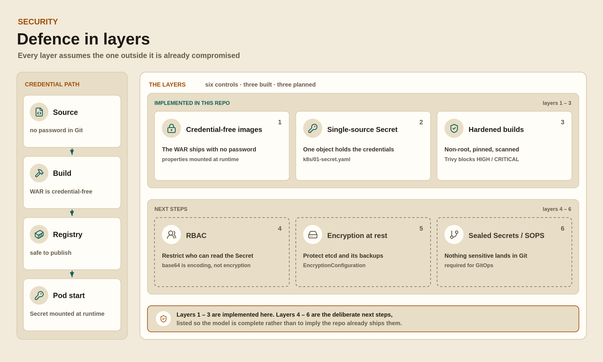

# VProfile on Kubernetes

Deploying a multi-tier Java application as four secure microservices on a
**self-managed, highly available** Kubernetes cluster — bootstrapped with `kubeadm` on
RHEL 9, running inside an AWS VPC, fronted by HAProxy.




> Both diagrams in `docs/` ship as PNG for GitHub and as SVG if you want to edit them.

---

## Table of Contents

- [Overview](#overview)
- [What this project demonstrates](#what-this-project-demonstrates)
- [Architecture](#architecture)
- [Repository Structure](#repository-structure)
- [Prerequisites](#prerequisites)
- [Quick Start](#quick-start)
- [Security](#security)
- [Update Strategies](#update-strategies)
- [Troubleshooting](#troubleshooting)
- [Known Limitations & Roadmap](#known-limitations--roadmap)
- [Acknowledgment](#acknowledgment)
- [Author](#author)

---

## Overview

**VProfile** is a classic multi-tier Java (Spring MVC) web application — a small social
network whose stack mirrors real enterprise systems. In its original form each tier ran on
its own VM. This project re-platforms it as **four independent microservices** on
Kubernetes: self-healing, scalable, and reproducible.

| Tier | Service | Image | Port |
|---|---|---|---|
| Application | `app01` | Tomcat 9 · Java WAR | 8080 |
| Database | `db01` | MySQL 8.0 (seeded `accounts`) | 3306 |
| Cache | `mc01` | Memcached | 11211 |
| Broker | `rmq01` | RabbitMQ | 5672 |

The original Nginx web tier is **dropped** — HAProxy plays that role at the cluster edge.
All images are built from source, hardened, scanned, and pushed to `alnaqib/*`.

---

## What this project demonstrates

The point of this repo is not that the app runs. It is *how* the cluster underneath it was
built and secured — by hand, without a managed control plane.

- **A self-managed HA control plane.** Three masters joined through a single
  `--control-plane-endpoint`, so losing one does not lose the API.
- **One load balancer, two jobs.** The same HAProxy VM fronts the application on `:80`
  *and* the Kubernetes API on `:6443`. That is what makes the control plane highly
  available.
- **Credential-free images.** The WAR is built with no password in it; the real
  `application.properties` is mounted at runtime from a Secret, so the image is safe to
  push to a public registry.
- **A scan gate before the registry.** Trivy runs on every image and a HIGH/CRITICAL
  finding stops the push, not the deploy.
- **Workload-aware update strategies.** `Recreate` for the `ReadWriteOnce` database,
  `RollingUpdate` for the stateless app — chosen for a reason, documented below.

---

## Architecture

The platform runs inside an **AWS VPC** (`eu-north-1`) spread across two Availability
Zones. Public subnets host HAProxy, the Internet Gateway and the NAT Gateway; private
subnets host the Kubernetes nodes.

```
Users
  └─ Internet Gateway
       └─ HAProxy ──:80──▶ NodePort :30080 ──▶ app01 pods ──▶ db01 · mc01 · rmq01
                └──:6443──▶ control plane (3 × master, HA endpoint)

  private nodes ──▶ NAT Gateway ──▶ Internet Gateway   (egress only)
```

**Cloud network**

- **2 Availability Zones** (`eu-north-1a` / `1b`) for a real HA spread.
- **4 subnets** — public (HAProxy, NAT, IGW) and private (Kubernetes nodes).
- Private nodes reach the internet **outbound only**, via NAT → IGW. Inbound traffic
  reaches the application only through HAProxy.

**Cluster**

| Component | Choice |
|---|---|
| Bootstrap | `kubeadm` v1.36 |
| Container runtime | CRI-O v1.36 |
| CNI | Calico v3.32.1, pod CIDR `192.168.0.0/16` |
| Node OS | RHEL 9 |
| Topology | 3 × control-plane + 3 × worker |
| Control-plane endpoint | `HAPROXY_IP:6443` |
| Storage | `local-path-provisioner` (default StorageClass) |

---

## Repository Structure

```
Vprofile-Secured-Orchestrator/
├── k8s-setup.sh                # bootstrap a node: master | control-plane | worker
├── build-and-push.sh           # build → Trivy scan → push to alnaqib/*
├── deploy.sh                   # install storage class + apply manifests in order
├── images/                     # one hardened Dockerfile per service
│   ├── app/                    # multi-stage Tomcat · credential-free
│   ├── db/                     # MySQL 8.0, seeded 'accounts'
│   ├── memcached/
│   └── rabbitmq/
├── k8s/                        # manifests, numbered in apply order
│   ├── 00-namespace.yaml
│   ├── 01-secret.yaml          # db + rmq credentials
│   ├── 02-db.yaml              # PVC + Deployment + Service (db01)
│   ├── 03-memcached.yaml
│   ├── 04-rabbitmq.yaml
│   └── 05-app.yaml             # app-config Secret + Deployment + NodePort (app01)
├── haproxy/vprofile.cfg        # frontend/backend for the HAProxy VM
├── docs/                       # architecture diagrams
└── VProfile-Kubernetes-ALnaqib.pptx
```

> `src/` (the VProfile application source) is **not committed** — `build-and-push.sh`
> clones it on first run, and the `app` and `db` images build from it.

---

## Prerequisites

- **6 RHEL 9 machines** — 3 control-plane, 3 workers — plus **one HAProxy VM**.
- Each node needs the HAProxy VM reachable on `:6443` before it can join.
- A workstation with **Docker** (or Podman) and **Trivy** for building and scanning.
- `kubectl` configured against the cluster.

---

## Quick Start

### 0. Bootstrap the cluster

`k8s-setup.sh` prepares a RHEL 9 node and either initialises or joins the cluster. It
installs CRI-O and the kubelet, disables swap, loads `overlay` / `br_netfilter`, sets the
required sysctls, and then branches on the node's role.

```bash
# 1) first control-plane — runs kubeadm init and installs Calico
sudo ROLE=master HAPROXY_IP=10.0.0.100 ./k8s-setup.sh

# 2) the other two masters
sudo ROLE=control-plane JOIN_CMD="kubeadm join ... --control-plane --certificate-key ..." ./k8s-setup.sh

# 3) each worker
sudo ROLE=worker JOIN_CMD="kubeadm join ..." ./k8s-setup.sh
```

Run it with no variables for an interactive prompt instead.

The first master writes both join commands to `/root/join-worker.command` and
`/root/join-control-plane.command`. **The token is valid for 24 h and the certificate-key
for 2 h only** — if they expire, regenerate them on the first master:

```bash
kubeadm token create --print-join-command
kubeadm init phase upload-certs --upload-certs   # last line = certificate-key
```

Verify:

```bash
kubectl get nodes -o wide
```

### 1. Build, scan & push the images

```bash
# clones src/ if missing, builds 4 images, scans with Trivy, pushes to Docker Hub
./build-and-push.sh
```

### 2. Deploy to the cluster

```bash
# installs local-path-provisioner, then applies manifests in order
./deploy.sh

kubectl -n vprofile get pods -w
```

Expected:

```
NAME                READY   STATUS    RESTARTS
vpro-app-xxxx       1/1     Running   0
vpro-app-xxxx       1/1     Running   0
vpro-db-xxxx        1/1     Running   0
vpro-mc-xxxx        1/1     Running   0
vpro-rmq-xxxx       1/1     Running   0
```

### 3. Expose via HAProxy & access

Add the `haproxy/vprofile.cfg` block on the HAProxy VM, replacing the backend addresses
with the real worker `INTERNAL-IP`s from `kubectl get nodes -o wide`, then:

```bash
sudo haproxy -c -f /etc/haproxy/haproxy.cfg && sudo systemctl reload haproxy
```

| Method | URL |
|---|---|
| Via HAProxy (main) | `http://<haproxy-public-ip>/` |
| Direct NodePort | `http://<node-ip>:30080/` |
| Quick test | `kubectl -n vprofile port-forward svc/app01 8080:8080` |

Default login: **`admin_vp` / `admin_vp`**.

> These are demo credentials committed for reproducibility. Replace every password in
> `k8s/01-secret.yaml` before any real use.

---

## Security



Security here is applied in **layers**, each closing a different gap. Two are implemented
in this repo; the rest are the deliberate next steps, listed so the model is complete.

**Implemented**

1. **Credential-free images.** The app WAR is built with **no password**; the real
   `application.properties` is mounted at runtime from a Secret. The image is generic and
   safe to store in a public registry.
2. **Single-source Secret.** One object holds the credentials, so everything below it
   actually has something to protect.
3. **Hardened builds.** Multi-stage Dockerfiles, non-root users, pinned base versions, and
   a **Trivy** scan for HIGH/CRITICAL before every push.

**Next steps (not yet in this repo)**

4. **RBAC** — restrict *who* can read the Secret. Kubernetes Secrets are base64, which is
   encoding, not encryption; without RBAC, step 2 buys very little.
5. **Encryption at rest** — an `EncryptionConfiguration` on the API server protects the
   Secret inside `etcd` and its backups.
6. **GitOps-safe secrets** — **Sealed Secrets** or **SOPS**, so nothing sensitive ever
   lands in Git.

---

## Update Strategies

| Service | Strategy | Why |
|---|---|---|
| **Database** (`db01`) | `Recreate` | The volume is `ReadWriteOnce` — only one pod may hold it. A rolling update would start a second pod against the same PV and risk corruption. `Recreate` stops the old pod first. |
| **Application** (`app01`) | `RollingUpdate` | The app tier is stateless. Two replicas are updated gradually with **zero downtime**; the readiness probe gates each new pod before it serves traffic. |

---

## Troubleshooting

Real issues hit — and fixed — while building this:

| Symptom | Root cause | Fix |
|---|---|---|
| HAProxy returns **503** | Health check `GET /` returns a **302** redirect to `/login`, so HAProxy marks every backend **DOWN** | Health-check `GET /login` (returns **200**), or accept `2xx,3xx` |
| App can't reach MySQL | MySQL 8 defaults users to `caching_sha2_password` → JDBC fails over plain TCP (`Public Key Retrieval is not allowed`) | Start MySQL with `--default-authentication-plugin=mysql_native_password` |
| Password leaks with the image | Credentials were **baked into the WAR** at build time | Credential-free image + `application.properties` mounted from a Secret |
| No traffic through HAProxy | Backend pointed at the wrong worker IPs | Use the real `INTERNAL-IP`s from `kubectl get nodes -o wide` |
| `PVC` stuck in `Pending` | No default StorageClass on a `kubeadm` cluster | Install `local-path-provisioner` and mark it default |
| `kubeadm join --control-plane` fails | The certificate-key expired — it lives for **2 h**, the token for 24 h | Re-run `kubeadm init phase upload-certs --upload-certs` on the first master |

---

## Known Limitations & Roadmap

Stated plainly, because a lab cluster that pretends to be production helps nobody.

| Area | Current state | Next |
|---|---|---|
| Host hardening | `k8s-setup.sh` sets SELinux to permissive and disables `firewalld` to get the cluster up | Keep SELinux enforcing with the right `container-selinux` policy; open only the kubeadm ports instead of stopping the firewall |
| Secrets | Plain Kubernetes Secret, base64 | RBAC + `EncryptionConfiguration` at rest, then Sealed Secrets / SOPS |
| Network policy | Calico is installed but no `NetworkPolicy` objects are applied | Default-deny per namespace, then explicit app → db / mc / rmq allows |
| Ingress | NodePort + HAProxy | An Ingress controller with TLS termination |
| CI/CD | `build-and-push.sh` is run by hand | A pipeline that builds, scans, pushes and deploys on commit |
| Observability | None | kube-prometheus-stack for metrics and alerts |
| Backup | None | `etcd` snapshots and Velero for the namespace |

---

## Acknowledgment

Sincere thanks to **Eng. Abdelrahman** for the guidance, the clear explanations, and the
hands-on mentorship that made this project possible — especially the patience in teaching
the **"why"** behind every step, not just the **"how."**

---

## Author

**Yousef Salem** — DevOps Engineer · **ALnaqib** · Cairo, Egypt

- GitHub: [@yousefsalemW](https://github.com/yousefsalemW)
- Docker Hub: `alnaqib`

VProfile on Kubernetes · DevOps · 2026
